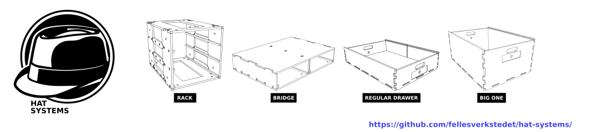
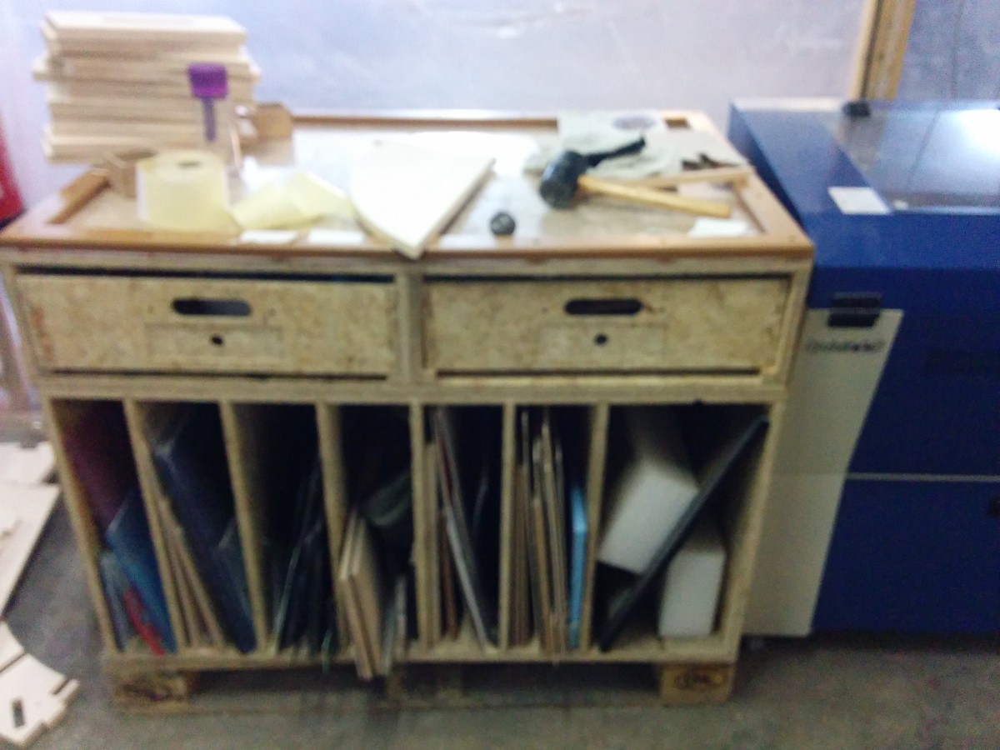
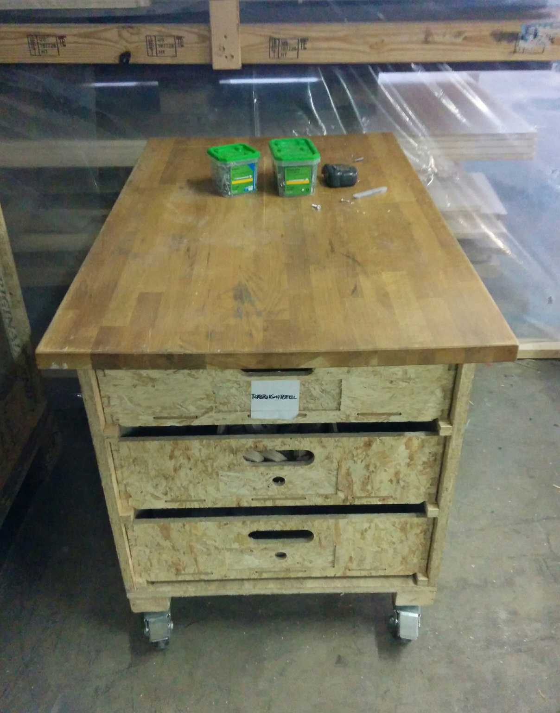
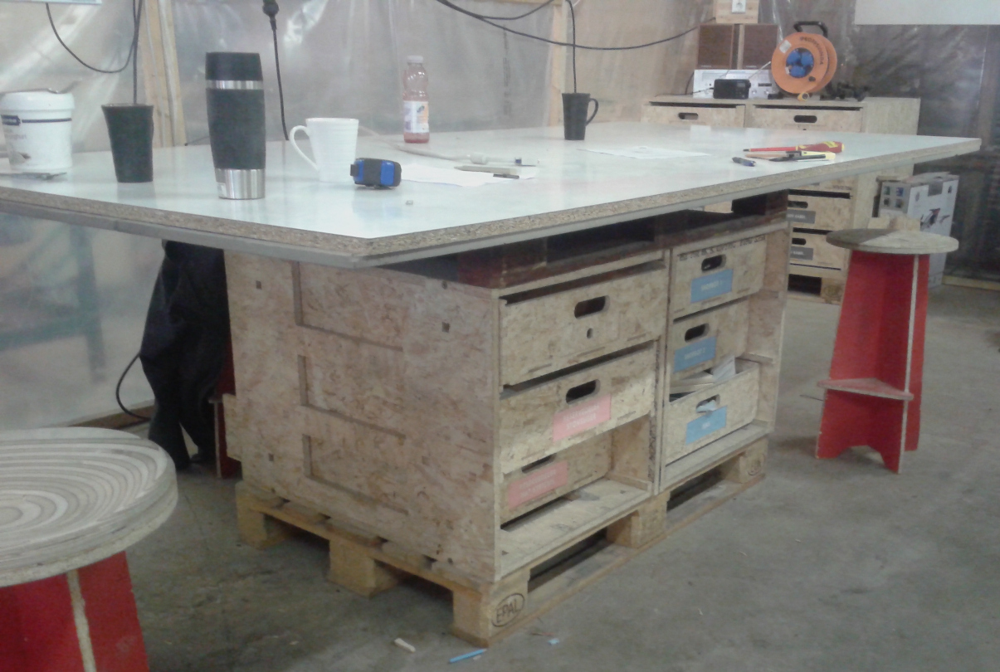
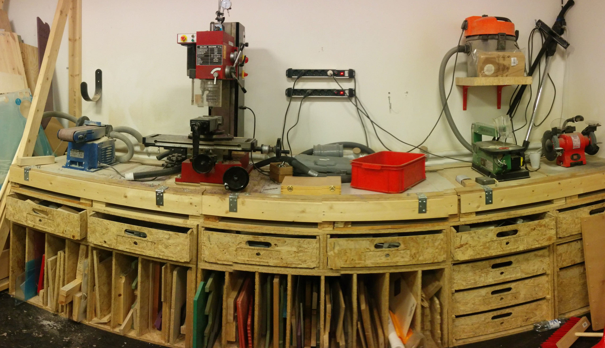
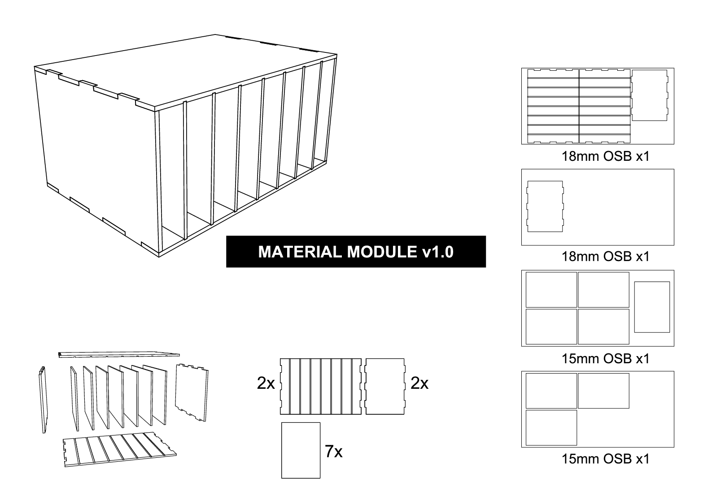
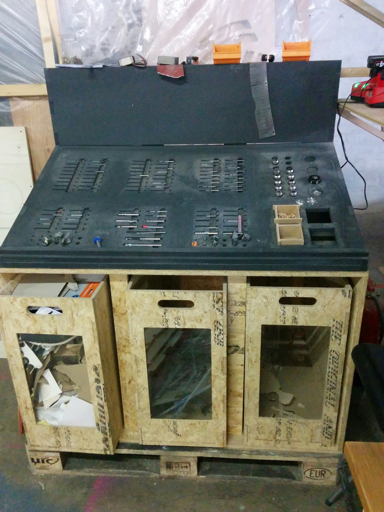

# Hat Systems
Hat Systems is a general purpose storage system for workshop storage of tools and inventory.

Designed with these basic principles in mind; modular, low-cost, heavy-duty/durable and spacious. The module sizes is designed to fit onto [EUR-palett](https://en.wikipedia.org/wiki/EUR-pallet), with a footprint size of 120x80 centimeter. This allows them to be moved around easily in an production or workshop environment, or even transported between locations.

Originally developed as for use in-house at [Fellesverkstedet](http://fellesverkstedet.no), now also in use at [Bitraf](http://bitraf.no), and open for reproduction across the world.

## License

Distributed under Creative Commons Attribution 4.0 International. [CC-BY 4.0](http://creativecommons.org/licenses/by/4.0/).

## Contributors
Conceptualized for Fellesverkstedet by [Hans Christian Skovholt](http://www.skovholt.net/) and Graham A. Hayward.

Modules have been produced by Jonas Sætervik, [Siemen Cuypupeiers](http://www.siemencuypers.com) and Anthony Poldervaart. And by Thomas Winther at Bitraf.

Have you made a Hat Systems module? Or have designed additional modules? [Let us know!](https://github.com/fellesverkstedet/hat-systems/issues/new).

## Example configurations

### Storage shelves

Per palett: `2x2 Rack`, with  `3x Drawer Regular` in most of the racks.

### Laser material storage

`1x Material Storage` with `1x Bridge` on top.

## Roller table with drawers

`1x Rack` with `3x Drawer Regular`, a benchplate on top and wheels mounted underneath.
Very useful for moving large cutsheets and finished parts around workshop, to and from CNC router.

## Collaboration table

`2x Rack` with a tabletop made out of one old sacrificial layer from CNC and one white-painted sheet (120x240cm).
Comfortable to stand and work around, or one can sit on bar-style stools.

## Machine tools workbench

The machines on top of the work surface are each attached to a plate with chamfered edges.
An opposing chamfered edge in back, and  hinged profile in front locks the plates in place.
This allows some flexibility in moving the machines around.

Picture from Bitraf makerspace.

## Prerequisites for making
You will need accesss to a large-scale CNC mill/router, capable of handling cutsheets of at least 60x80 cm (120x80 for current bridge design),
and cutting 18 mm [OSB](https://en.wikipedia.org/wiki/Oriented_strand_board).
Examples include the Shopbot PRS, or an extended Shapeoko/XCarve.

If you don't have access to such a machine, check out your local [FabLab](https://www.fablabs.io/map), makerspace or [hackerspace](https://wiki.hackerspaces.org/List_of_Hacker_Spaces)! Or find someone to manufacture it for you locally using [Fabhub.io directory](https://www.fabhub.io/directory).

Ready-to-use cutsheet geometry is included, but you will need to set up the toolpaths yourself using the CAM software for your machine.

## Modules

[Sketchup project source](./Hat_Systems_assembled.skp), for modifying or creating new modules.

### Rack

The base module, which drawers fit into.

Made of 18mm OSB.

Is put together with 8 countersunk socket head M8 x 50mm bolts and square nuts M8 x 13 x 5MM (DIN 7991/ISO 10462).
The countersunk bolts facilitates placing two units side by side on a pallett.

The rack is assembled with bolts in order to make it possible to dissasemble for transport. But could theoretically be glued or screwed together as well.

[.DXF original geometry](./Rack/RACK_full_sheet_v1.0_no_dogbones_no_hdd.dxf) | 
[Cutsheet .DXF (includes dogboones & holddown, for <=6mm tool)](./Rack/RACK_full_sheet_v1.0_6mm_dogbones.dxf) | 
[.STL 3d-model](./Rack.stl)

### Drawer Regular

Regular drawer that will fit most stuff.

Made of 12mm OSB, as well as 6mm MDF for drawer bottoms.

[.DXF original geometry](./Regular_drawer/DRAWERS_REGULAR_full_sheet_v1.0_no_dogbones_no_hdd.dxf) | 
[Cutsheet .DXF (includes dogboones & holddown, for <=6mm tool)](./Regular_drawer/DRAWERS_REGULAR_full_sheet_v1.0_6mm_dogbones.dxf) | 
[.STL 3d-model](./Drawer_regular.stl)

You will also need one drawer bottom.

[.DXF original geometry](./Drawer_bottom/DRAWER_BOTTOM_full_sheet_v1.0_no_dogbones_no_hdd.dxf) | 
[Cutsheet .DXF (includes dogboones & holddown, for <=6mm tool)](./Drawer_bottom/DRAWER_BOTTOM_full_sheet_v1.0_6mm_dogbones.dxf) | 

### Drawer BigOne

Supersized drawer, takes the place of two regular drawers in height. Otherwise identical to Drawer Regular.

[.DXF original geometry](./Big_One_drawer/BIG_ONE_Drawer_no_dogbones.dxf) | 
[Cutsheet .DXF (includes dogboones & holddown, for <=6mm tool)](./Big_One_drawer/BIG_ONE_Drawer_6mm_dogbones.dxf) | 
[.STL 3d-model](./Drawer_big_one.stl)

You will also need one drawer bottom, see above!

### Bridge

Forms a solid surface on top of two racks, as well as housing for two regular drawers.
Useful to create a working sturface, with height comfortable for standing work.

Original geometry [.DXF 1](./Big_One_drawer/Bridge/BRIDGE_v0.9_no_dogbones_1of2.dxf) [.DXF 2](./Big_One_drawer/Bridge/BRIDGE_v0.9_no_dogbones_2of2.dxf) | 

## Material Storage

Full-width module for storing materials vertically.

**Work-in-progress!** Files should be scrutinized before any attempt to produce.

[Sketchup project](./Material_storage/Material_storage.skp) | 
[.DXF export](./Material_storage/Material_storage.dxf) | 
[.STL 3d-model](./Material_storage/Material_storage.stl)

## Trash cans

**Work-in-progress!** Files currently missing.

Trash can rack, including 3x trash cans.

The ER20 collet and milling bit holder on top is also to-be-released.

### Design iterations in the wild
* A [bedbunk drawer](https://github.com/apetrynet/bunk_drawers) variation by apetrynet, designed in Freecad

## TODO

* Add picture of Bitraf island module, and design files
* Material Storage: Finish/verify files, mark complete.
* Rack: Remove mostly-unused bolt holes in sides. They stay still by their own weight.
* Add a template .SVG file for drawer label (for ease of making on laser/printer)
* Trash cans: Publish files, create assembly drawing
* Milling bit holder: Publish in separate project, link here

